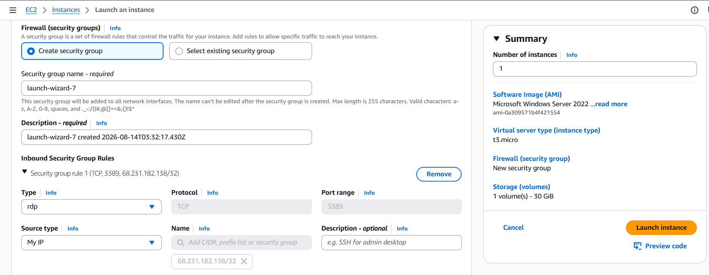
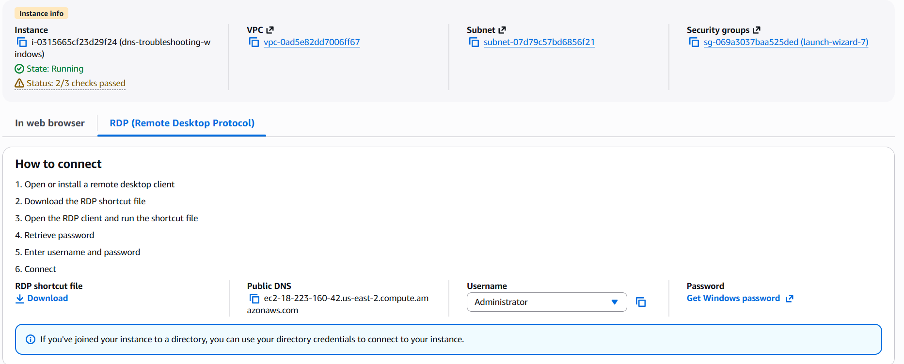
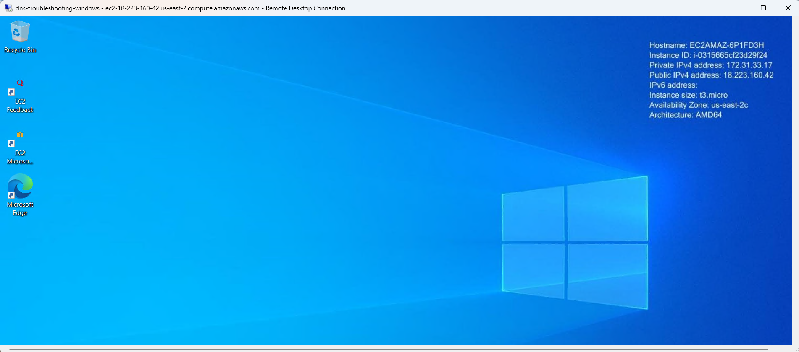
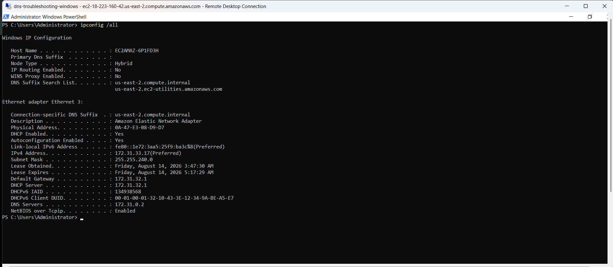
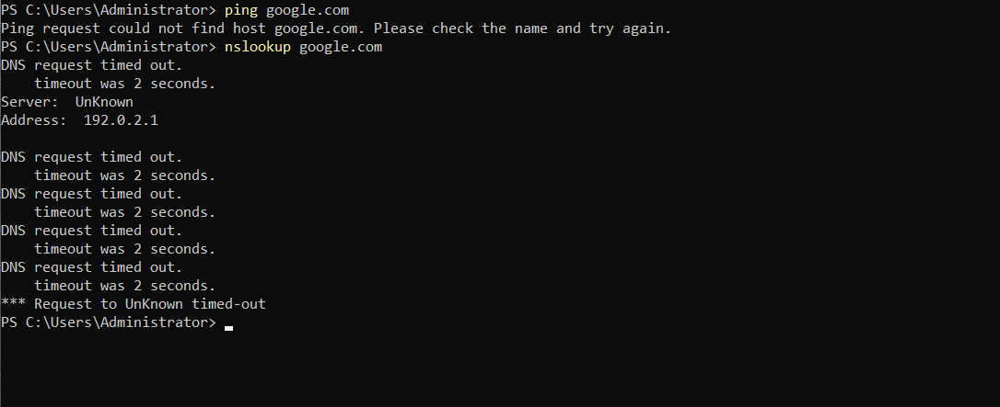
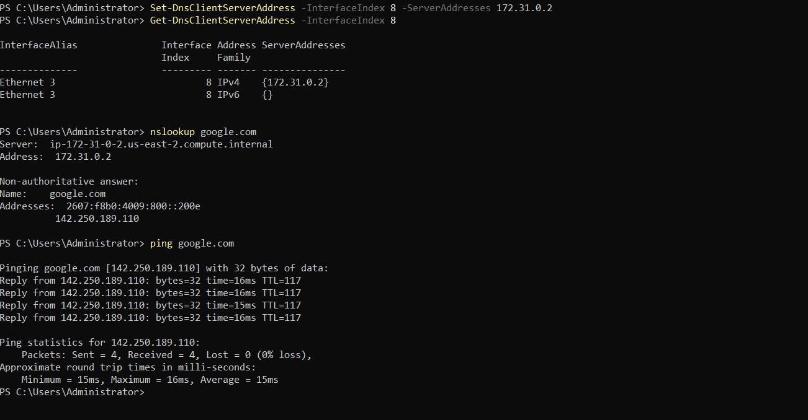

# DNS Troubleshooting Lab

## Overview

This lab simulates a Help Desk incident involving a Windows Server 2022 EC2 instance that is unable to access websites using domain names.

The lab demonstrates how to isolate a DNS-related connectivity issue by testing network layers in order — from IP configuration up to hostname resolution — instead of guessing at a fix.

## Scenario

### Ticket ID

`DNS-001`

### Priority

Medium

### Category

Network Connectivity / DNS

### User Report

> "My computer is connected to the internet, but I can't access websites by their names."

The objective was to determine whether the issue was caused by:

* Incorrect IP configuration
* Gateway connectivity
* General internet connectivity
* DNS resolution
* Incorrect DNS server configuration

## Environment

### AWS

* Amazon EC2
* Windows Server 2022 Base
* Instance type: `t3.micro`
* Default VPC
* Public IPv4 address enabled
* Security Group configured for RDP (restricted to my IP)
* EBS-backed EC2 instance

### Windows

* Windows Server 2022
* PowerShell
* Amazon Elastic Network Adapter (ENA)
* Network interface: `Ethernet 3`
* Interface Index: `8`

## Setup

The instance was launched with a security group scoped to allow RDP (port 3389) only from my IP address.



Connected to the instance using RDP with the auto-generated Administrator credentials.





## Initial Network Configuration

With the instance up and RDP connected, `ipconfig /all` was run to capture the working baseline before anything was changed.



| Configuration   | Value           |
| --------------- | --------------- |
| IPv4 Address    | `172.31.33.17`  |
| Subnet Mask     | `255.255.240.0` |
| Default Gateway | `172.31.32.1`   |
| DNS Server      | `172.31.0.2`    |

At this point the instance had a valid IP configuration and a working DNS server, and hostname resolution worked normally (e.g. `nslookup google.com` and `ping google.com` both succeeded, prior to the failure simulation below).

*Note: the baseline gateway ping (`ping 172.31.32.1`), the baseline `ping 8.8.8.8`, and the baseline successful `nslookup`/`ping google.com` were performed as part of establishing this working state but weren't individually captured as separate screenshots — only the final `ipconfig /all` snapshot above and the pass/fail table below are backed by images.*

## Simulating the DNS Failure

The DNS server was intentionally pointed at an unreachable address to reproduce a DNS failure on purpose:

```powershell
Set-DnsClientServerAddress -InterfaceIndex 8 -ServerAddresses 192.0.2.1
```

`192.0.2.0/24` is a documentation/testing-only range (RFC 5737), so it's guaranteed not to respond — useful for reliably reproducing a DNS timeout without depending on an external server actually being down.

*This command itself wasn't captured on screen — the screenshot below shows the resulting failure, where `nslookup` confirms the client is now querying `192.0.2.1`.*

## Failure Testing

```powershell
ping google.com
nslookup google.com
```



* `ping google.com` → `Ping request could not find host google.com.`
* `nslookup google.com` → DNS request timed out against `192.0.2.1`

## Root Cause

The Windows network adapter had been configured to use an invalid/unreachable DNS server (`192.0.2.1`). The underlying network connection was still operational — the failure was isolated to name resolution, not connectivity.

| Test                        | Result   | Evidence                |
| ---------------------------- | -------- | ------------------------ |
| IP configuration              | PASS     | Screenshot 04            |
| Gateway connectivity          | Not pictured | Performed, not captured |
| Internet connectivity by IP   | Not pictured | Performed, not captured |
| DNS resolution                | FAIL     | Screenshot 05            |
| Hostname connectivity         | FAIL     | Screenshot 05            |

## Resolution

The original DNS server was restored and verified, then DNS resolution and hostname connectivity were re-tested:

```powershell
Set-DnsClientServerAddress -InterfaceIndex 8 -ServerAddresses 172.31.0.2
Get-DnsClientServerAddress -InterfaceIndex 8
nslookup google.com
ping google.com
```



* `Get-DnsClientServerAddress` confirms `172.31.0.2` is back on interface 8
* `nslookup google.com` resolves successfully
* `ping google.com` succeeds — 4 packets sent, 4 received, 0% loss

## Troubleshooting Methodology

The point of this lab wasn't memorizing commands — it was building a repeatable way to answer: *what question am I trying to answer, and which tool gives me the evidence?*

| Question                                     | Tool                          |
| --------------------------------------------- | ------------------------------ |
| What is the machine's network configuration?  | `ipconfig` / `ipconfig /all`   |
| Can the machine reach its gateway?            | `ping <gateway>`               |
| Can the machine reach the internet by IP?     | `ping 8.8.8.8`                 |
| Can DNS resolve a hostname?                   | `nslookup <hostname>`          |
| Can Windows communicate using a hostname?     | `ping <hostname>`              |
| Which network adapters exist?                 | `Get-NetAdapter`               |
| Which DNS server is configured?               | `Get-DnsClientServerAddress`   |
| How can the DNS configuration be changed?     | `Set-DnsClientServerAddress`   |

## Real-World Help Desk Application

A user may report: *"The internet isn't working."*

A Help Desk technician shouldn't immediately assume the whole network connection is down. Instead, work down the chain:

```text
Can the computer reach the gateway?
            ↓
Can it reach the internet by IP?
            ↓
Can DNS resolve a hostname?
            ↓
Can the computer connect using that hostname?
```

This isolates the actual failing layer and prevents unnecessary configuration changes.

## Important DNS Consideration

DNS can be working correctly overall while one specific hostname still fails:

```text
google.com                  → works
youtube.com                 → works
fileserver.company.local    → fails
```

Possible causes include a missing or incorrect DNS record, an internal DNS zone problem, Active Directory DNS, split-DNS configuration, VPN routing, a stale cache, or the internal server itself being down. In a corporate environment, swapping an org's internal DNS server for a public one may restore public internet access while breaking internal resources — so the fix has to match the actual failing layer.

## Skills Demonstrated

* AWS EC2
* Windows Server
* RDP
* AWS Security Groups
* IPv4 networking
* DNS troubleshooting
* PowerShell
* `ipconfig`, `ping`, `nslookup`
* `Get-NetAdapter`, `Get-DnsClientServerAddress`, `Set-DnsClientServerAddress`
* Layered troubleshooting and root cause isolation
* Incident documentation

## Final Outcome

The simulated DNS incident was diagnosed and resolved by isolating the failure to the DNS layer rather than assuming a general connectivity problem:

```text
Identify the symptom
        ↓
Collect evidence
        ↓
Test each network layer
        ↓
Isolate the failure
        ↓
Apply the appropriate fix
        ↓
Verify the fix
        ↓
Document the incident
```
