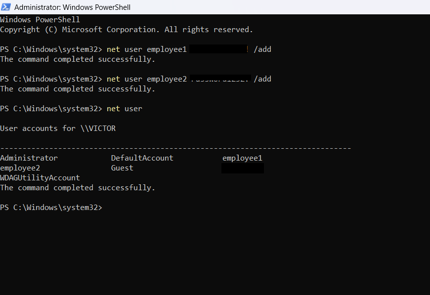
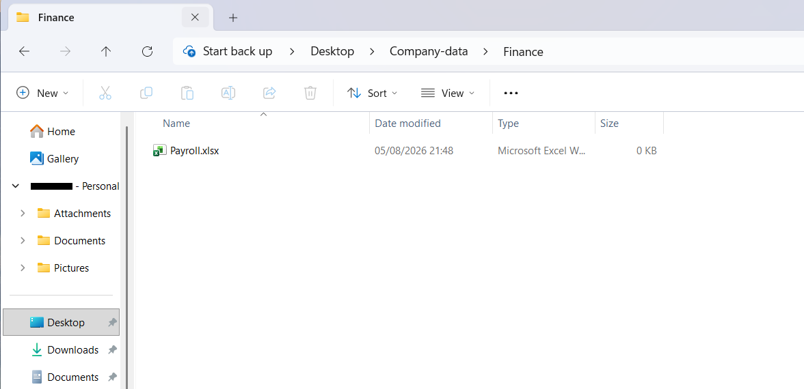
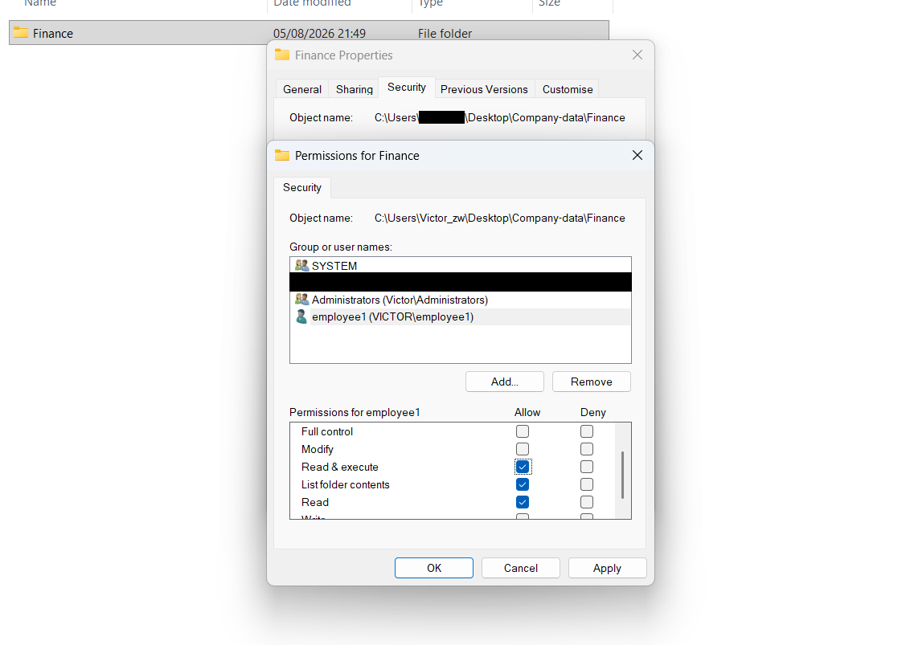
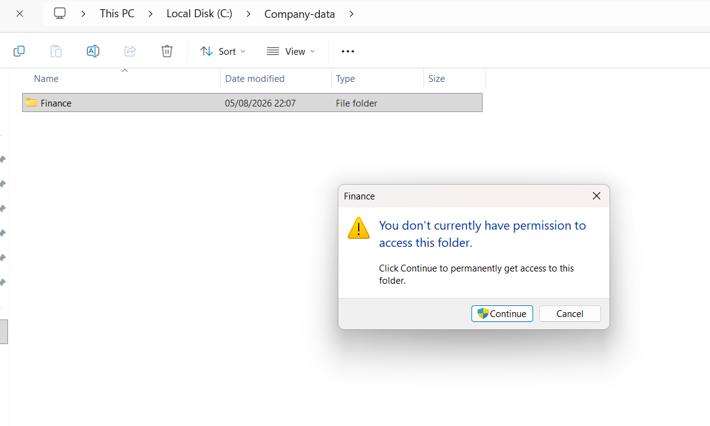
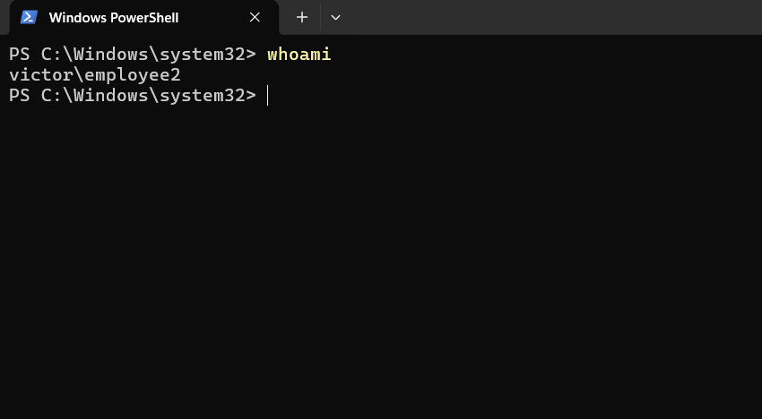
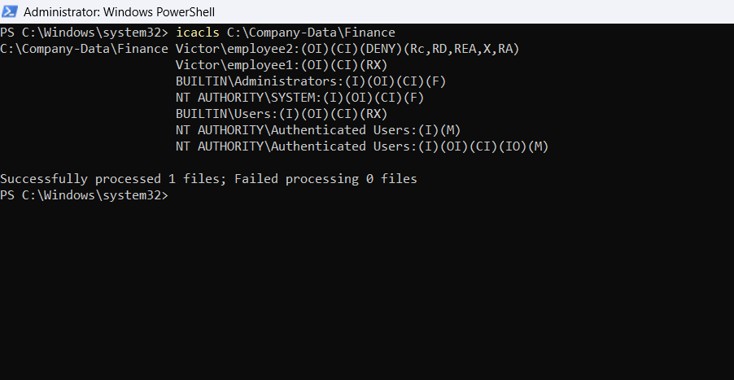
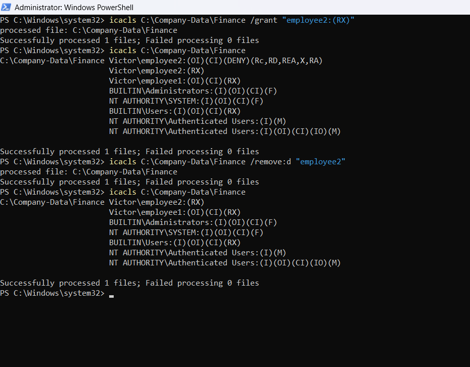
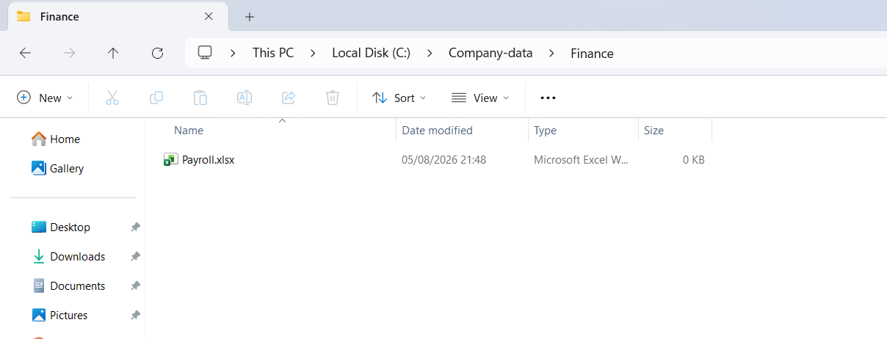

# Folder Access Denied: Explicit NTFS DENY Override

**Windows Help Desk Lab | Simulated ticket HD-2026-004**

## Overview

This lab simulates a help desk ticket in which a user is blocked from a company Finance folder with an "access denied" message.

Investigating with `icacls` showed that the problem was not a missing permission. The user's account carried an **explicit DENY entry**, which takes precedence over ALLOW entries. Removing the DENY entry resolved the issue.

---

## Scope

- Local NTFS permissions on a single Windows 11 machine, using two local test accounts (`employee1`, `employee2`).
- The scenario describes a "shared" company folder, but **no SMB network share, domain, or Active Directory was used in this lab**. Access was controlled entirely by NTFS permissions on the local folder.
- For a domain-based approach with security groups, see the [Active Directory lab](../active-directory-lab/).

---

## Scenario

A user (`employee2`) cannot open the Finance folder. Windows reports that they don't have permission to access it.

As the help desk technician, the goals were to:

- Reproduce the problem and identify the affected account
- Inspect the folder's permissions
- Identify the root cause
- Restore access
- Verify the result and document it

> Scenario premise: other staff can open the folder. This was part of the ticket story and is **not demonstrated** in the screenshots.

---

## Environment

| Component | Details |
|---|---|
| Operating system | Windows 11 (edition not shown in screenshots) |
| Machine | Single standalone machine (`VICTOR`), local accounts only |
| Accounts | `employee1` (granted Read & execute), `employee2` (affected user) |
| Folder | `C:\Company-Data\Finance`, containing `Payroll.xlsx` (0 KB placeholder file) |
| Tools | PowerShell (elevated for setup and permission changes, standard session for `whoami`), File Explorer, `icacls` |
| Category | File access / permissions |

---

## Walkthrough

### 1. Lab setup (screenshots 01 to 03)

Two local accounts were created with `net user` and listed to confirm they existed. A `Finance` folder containing `Payroll.xlsx` was created, and its Security settings were opened to view permissions.


*Screenshot 01: Creating `employee1` and `employee2` and listing local accounts. Passwords and the technician's own account name are redacted.*


*Screenshot 02: The Finance folder containing `Payroll.xlsx`. Personal details redacted.*


*Screenshot 03: Permissions for the Finance folder. `employee1` is allowed Read & execute, List folder contents, and Read. `employee2` does not appear in this list. Personal details redacted.*

### 2. Reproduce the issue (screenshot 04)

Opening the Finance folder displays "You don't currently have permission to access this folder," with a Continue button that prompts for administrator elevation.


*Screenshot 04: The access denied message. The logged-in account is not visible in this screenshot.*

### 3. Identify the affected account (screenshot 05)

`whoami` confirmed the session was running as `employee2`.


*Screenshot 05: `whoami` returns `victor\employee2`.*

### 4. Inspect the folder's permissions (screenshot 06)

`icacls` on the folder revealed the cause.


*Screenshot 06: Full ACL for the Finance folder.*

Key findings in the output:

- `Victor\employee2:(OI)(CI)(DENY)(Rc,RD,REA,X,RA)`: an **explicit DENY** covering read-related rights (read permissions, list/read data, read extended attributes, traverse/execute, read attributes). `(OI)(CI)` means it applies to the folder and everything inside it.
- `employee2` has **no explicit ALLOW entry**.
- `Victor\employee1:(OI)(CI)(RX)`: explicit Read & execute for the other test account.
- Inherited entries (marked `(I)`) include `BUILTIN\Users:(I)(OI)(CI)(RX)`.

### 5. Attempt a fix and remove the DENY (screenshot 07)

An explicit Read & execute entry was added for `employee2`, and `icacls` was run again. The ACL then showed **both** the DENY and the new `(RX)` entry for `employee2`. The DENY entry was then removed with `/remove:d`, and the ACL was checked a final time.


*Screenshot 07: Grant, ACL check, DENY removal, and final ACL check, in that order.*

### 6. Confirm access (screenshot 08)


*Screenshot 08: The Finance folder opens and lists `Payroll.xlsx`. The logged-in account is not visible in this screenshot.*

---

## Root Cause

`employee2` had an explicit DENY entry on the Finance folder for read-related rights, applied to the folder and its contents. In NTFS, an explicit DENY takes precedence over ALLOW entries, including inherited ones such as the `BUILTIN\Users` Read & execute entry in the same ACL. The user was therefore blocked regardless of other permissions.

## Resolution

The DENY entry for `employee2` was removed:

```powershell
icacls C:\Company-Data\Finance /remove:d "employee2"
```

The final ACL in screenshot 07 shows `employee2:(RX)` and no DENY entry.

**Technician's assessment (not tested in isolation):** the explicit `(RX)` grant was probably redundant, because the ACL already contains an inherited Read & execute entry for `BUILTIN\Users`, and local accounts created with `net user` are members of Users by default. The DENY removal was the change that mattered.

## Verification

- The final `icacls` output (screenshot 07) shows no DENY entry for `employee2`.
- The Finance folder opens and lists its contents (screenshot 08).

---

## Evidence Notes: What Is Not Pictured

To keep this write-up accurate, the following are **not captured** in the screenshots:

- The step that created the DENY entry for `employee2` (screenshot 03 shows the folder before it appears in the ACL).
- The logged-in account in screenshots 04 and 08.
- An access re-test after the explicit grant and before the DENY removal.
- The first grant attempt without quotes around the permission string, which failed with a PowerShell parsing error (see [commands.md](./commands.md)).
- A test showing another user (`employee1`) opening the folder.

Screenshots 01 to 03 show the folder on the Desktop (`...\Desktop\Company-data\Finance`), while screenshots 04 to 08 show it at `C:\Company-Data\Finance`. The move between locations was not captured.

---

## Skills Demonstrated

- Creating and listing local user accounts (`net user`)
- Reproducing and scoping a file access issue
- Confirming the active account with `whoami`
- Reading a full NTFS ACL with `icacls`, including inheritance flags and DENY entries
- Modifying and removing ACL entries with `icacls /grant` and `/remove:d`
- PowerShell quoting for `icacls` permission strings
- Writing a help desk ticket and a troubleshooting log from evidence

## Lessons Learned

- A successful `icacls /grant` does not guarantee access. Read the **entire** ACL and look for DENY entries before changing anything.
- An explicit DENY overrides ALLOW entries, including inherited ones.
- `/remove:d` removes only the DENY entries for a named user and leaves ALLOW entries alone.
- Write down the missed steps too. Being clear about what was and wasn't captured makes documentation more trustworthy.

## Prevention Recommendations

*Recommendations only; none of these were implemented in this lab.*

- Assign permissions through security groups instead of individual accounts, as in the [Active Directory lab](../active-directory-lab/).
- Avoid explicit DENY entries unless there is a clear need, since they are easy to forget and hard to spot.
- Periodically review folder ACLs for leftover DENY entries.
- Follow least-privilege access.

---

## Documentation

- [Commands and ACL notation](./commands.md)
- [Support ticket](./support-ticket.md)
- [Screenshots](./screenshots/)

*Personal details (names, email addresses, usernames, and passwords) have been redacted from the screenshots.*
